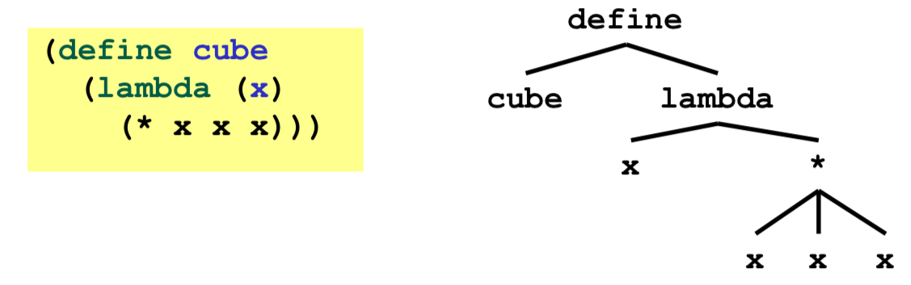

# Неделя I

## Introduction to Racket
Нет статической типизации, возможны ошибки на этапе исполнения. В ML такого не бывает.

Racket похож на Scheme, пошел от него. Синтаксис минималистичен, много скобочек для группировки, зато меньше синтаксических конструкций. Подробнее про Ракет можно почитать в [The Racket Guide](https://docs.racket-lang.org/guide/).

Все в Racket — выражение. Не нужно делать `return`, он как бы по умолчанию.

В Racket каждый файл — модуль и все внутри него приватно. Нужно самому указывать, что открывать вовне. Но есть способ сделать все публичным:

```scheme
(provide (all-defined-out))
```

## Racket Definitions, Functions, Conditionals
Определение переменных (binding):

```scheme
(define x 3)
(define y (+ x 2)) ; вызо функции `+` — скобки, имя функции и параметры
```

Пример функции:

```scheme
(define cube ; создали переменную, забайндили на анонимную функцию:
  (lambda (x) (* x x x)))

; Можно так, это синтаксический сахар:
(define (cube x)
  (* x x x))

; Вызов с выводом на экран:
(display (cube 3))
```

Функция принимает столько аргументов, сколько передано, не так, как в ML, где аргумент всегда 1. Можно создавать ф-и, принимающие произвольное кол-во аргументов, как умножение `(* x y z ...)`.

В Лиспах принято назвать идентификаторы (переменные, функции и пр.) через `-`: `my-append`.

Уловия `(if e1 e2 e3)`:

```scheme
; Пример рекурсивной функции с условием:
(define (pow x y)
  (if (= y 0) 1
      (* x (pow1 x (- y 1)))))
(pow1 2 3) ; 8
```

Каррирование в Ракет не очень часто используется, потому что можно передавать произвольное кол-во аргументов, но можно его юазть, если надо:

```scheme
(define pow2
  (lambda (x)
    (lambda (y)
      (pow1 x y))))
(define three-to-the (pow2 3))
(three-to-the 2)
```

## Racket Lists
[`null`](https://docs.racket-lang.org/reference/pairs.html#%28def._%28%28quote._~23~25kernel%29._null%29%29) — пустой список, функция `null?` проверяет, не пустой ли список:

```scheme
(define my-list null) ; `null` is bound to the empty list.
(null? my-list) ; #t
```

`(list e1 e2 ... en)` — список из n элементов. Синтаксический сахар для конструктора списков `(cons ...)`:

```scheme
(define my-list1 (list 1 2 3)) ; это то же самое, что
(define my-list2
    (cons 1 (cons 2 (cons 3 null))))
(equal? my-list1 my-list2) ; #t
```

`car/cdr` — голова/хвост списка:

```scheme
(car my-list1) ; 1
(cdr my-list1) ; '(2 3)
```

### Примеры
Функция, суммирующая элементы списка:

```scheme
(define (sum numbers)
  (if (null? numbers) 0
      (+ (car numbers) (sum (cdr numbers)))))

(sum (list 1 2 3 4)) ; 10
```

Функция `my-append`, которая добавляет один список в конец другого:

```scheme
(define (my-append2 xs ys)
  (if (null? xs) ys
      (cons (car xs) (my-append2 (cdr xs) ys))))
```

Функция `my-map`, которая пройдется по всем элементам списка и к каждому применит переданную функцию:

```scheme
(define (my-map xs fn)
  (if (null? xs) xs
      (cons (fn (car xs)) (my-map (cdr xs) fn))))
```

## Syntax and Parentheses
Синтаксис Ракета (или другого Лиспа) очень прост и все благодаря скобочкам. Далее следуют правила, их очень немного.

Терм (term) — все, что мы используем в программе. Термы могут быть такими:

- Атомы (atom), неделимые сущности (terms): `#f`, `#t`, `34`, "hello", `4.0`, `null`, `x`, ...
- Некоторые атомы являются спецформами (special form): `define`, `if`, ... С помощью макросов можно определять свои спецформы.
- Последовательность термов в скобочках: `(t1 t2 ... tn)`. Терм — рекурсивное определение, каждый терм может быть последовательностью: `(+ (lambda (x) (* (car x) 3)) 100)`.
    + Если `t1` является спецформой, то семантика последовательности зависит от нее (например, если `t1` это `if`, то `t2` — это предикат, `t3` выполнится если условие верное, `t4` — если нет). 
    + Если `t1` не спецформа, то последовательность — это вызов функции `t1`.

Это все правила, на которых построен язык. Много скобочек, зато мало правил.

Примеры:

```scheme
(+ 3 (car x))
; `+` — атом, поэтому это вызов функции

(lambda (x) (if x "hi" "bye"))
; `lambda` — спецформа, поэтому последовательность следующих термов важна.
; `x` — аргумент анонимной функции, далее следует ее тело.
```

Можно использовать квадратные скобки `[` вместо круглых, если хочется. Есть некоторые соглашения, где их лучше использовать, об этом позже.

Эти правила и скобочки позволяют очень просто преобразовать код в дерево для его компиляции или обработки (редакторам, например):



Атомы — листья дерева, последовательности — узлы. И нам вообще не нужно думать о приоритете операторов, как в выражении `x + y * z`. Никаких специальных правил не нужно, просто добавляем скобки где надо.

Еще пример:

```scheme
(define foo
       (lambda (x y z)
               (+ x (* y y (- z y)))))
; Листья тут: foo x y z x y y z y
```

## Parentheses Matter! (Debugging Practice)
Скобки всегда имеют значение, потому что скобки — это вызо функции.

- `(e)` — вызов выражения `e` как функции;
- `((e))` — вызов того, что вернет `e` как функцию.

Нормальный факториал:

```scheme
(define (fac n)
  (if (= n 0) 1
      (* n (fac (- n 1)))))
```

Факториалы с ошибкой:

```scheme
(define (fac1 n)
  (if (= n 0) (1) ; попытка вызвать `1` как функцию без аргументов
      (* n (fac (- n 1)))))

(define (fac1b n)
  (if (= n 0) (1) ; попытка вызвать `1` как функцию без аргументов
      (* n (fac (- n 1))))) ; здесь вызывает не та фнукция и ошибка появится только при вызове `(fact1b 0)`
```

См. [остальные примеры](resources/section5_video_code_files/87_parens_matter.rkt) функций с ошибками.

## Dynamic Typing
[Файл с примерами](resources/section5_video_code_files/88_dynamic_typing.rkt). Еще есть код [на JS](part_b/week1/my-code/88_dynamic_typing.js).

В Racket можно просто брать и создавать разнородные структуры данных. Например, списки, которые могут содержать числа, другие списки, строки, булевы значения и пр. Но за это приходится платить проверками значений перед тем, как с ними что-то делать:

```scheme
(define (sum2 xs)
  (if (null? xs)
      0
      (if (number? (car xs))
          (+ (car xs) (sum2 (cdr xs)))
          (if (list? (car xs))
              (+ (sum2 (car xs)) (sum2 (cdr xs)))
              (sum2 (cdr xs))))))
```

Эта функция суммирует элементы списка. Не числовые значения пропускаются.

## Cond
`cond` используют вместо вложенных `if`-ов. Код получается проще и понятнее. По сути `if` — синтаксический сахар для `cond` с двумя ветками.

`cond` — спецформа


```racket
(cond [e1a e1b]
      [e2a e2b]
      ...
      [eNa eNb]) ; Good style — `eNa` должно быть `#t`
```

Использовать `[` в условиях `cond` можно и нужно. Это соглашение по синтаксису, считается хорошим тоном.

Условия слева `e1a`, `e2a` ... `eNa` проверяются, если они истинны, то выполняется соответствующее условие справа.

Если так получится, что ни одно условие не выполнится и никакой результат не вернется, то `cond` вернет что-то странное и это плохо. Нужно следить, чтобы условия выполнялись. Поэтому хорошим тоном считается, чтобы последнее условие было `#t`:

```racket
(define (sum4 xs)
  (cond [(null? xs) 0]
        [(number? (car xs)) (+ (car xs) (sum4 (cdr xs)))]
        [(list? (car xs)) (+ (sum4 (car xs)) (sum4 (cdr xs)))]
        [#t (sum4 (cdr xs))])) ; good style

(sum4 (list "2" 1 2 #t (list "hi" 10) 3)) ; 16
```

**Выражение для `if` и `cond` не обязательно должно возвращать `#t` или `#f`**. Все, что не `#f` будет считаться `#t`. Только так. Пустой список, ноль — все тоже будет `#t`:

```racket
(cond [null (display "hello")]) ; выведет "hello", хоть в условии `null`
```

Так делается во многих динамических языках. Только там правила более хитрые (приведение типов в JS, например). В статических языках приведение типов не имеет смысла, там выражение для `if` должно иметь тип `Bool`.

Пример — функция, которая считает, сколько раз `#f` встречается в списке:

```racket
(define (count-falses xs)
  (cond [(null? xs) 0]
        [(car xs) (count-falses (cdr xs))] ; если (car xs) не `#f`, (car xs) can have any type
        [#t (+ 1 (count-falses (cdr xs)))])) ; все остальное будет `#f`
```

## Local Bindings
